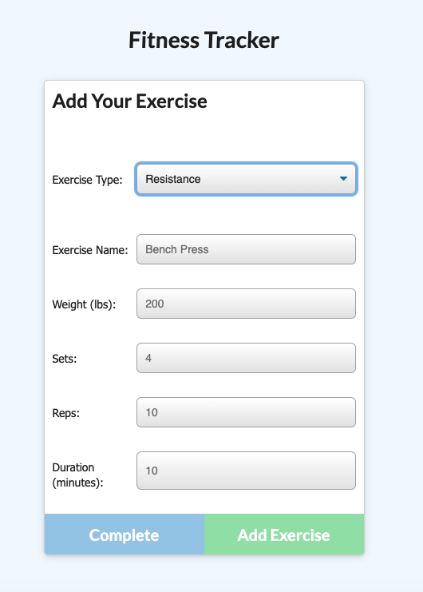

# Fitness Tracker
  
  ## Description
As an athlete, I want an app that will allow me to enter my workouts and view stats,
so that I can keep track of my progress

This project is a simple fitness tracker for athletes and active people. It was built using node.js, express.js, and MongoDB.
  

  ## Table of Contents
  #### [Installation](#Installation)  
  #### [Usage](#Usage)  
  #### [Future Work](#FutureWork)  
  #### [License](#License)  
  #### [Contributing](#Contributing)  
  #### [Tests](#Tests)  
  #### [Questions](#Questions)  
 

  ## Installation
  View the deployed app on Heroku:
  
  [Fitness App on Heroku](https://morning-island-97292.herokuapp.com/)
    

  ## Usage

From the landing page, the user will see some basic stats on their most recent workout. They can choose "Continue Workout" to add to the most recent workout, or "New Workout" to begin a new one. 

Either option will bring the user to the "Add Your Exercise" screen. The user can choose a Cardio or a Resistance workout, and will be prompted for some additional details based on that choice. 

At any point the user can click on "Dashboard" in the upper left corner. They will be able to view a dashboard of exercises completed in the last week and some data visualizations.

    

  ## License
  [https://opensource.org/licenses/MITnse](https://opensource.org/licenses/MITnse) 
  
        Copyright (c) (year) (copyright holders)

        Permission is hereby granted, free of charge, to any person obtaining a copy of this software and associated documentation files (the "Software"), to deal in the Software without restriction, including without limitation the rights to use, copy, modify, merge, publish, distribute, sublicense, and/or sell copies of the Software, and to permit persons to whom the Software is furnished to do so, subject to the following conditions:
        
        The above copyright notice and this permission notice (including the next paragraph) shall be included in all copies or substantial portions of the Software.
        
        THE SOFTWARE IS PROVIDED "AS IS", WITHOUT WARRANTY OF ANY KIND, EXPRESS OR IMPLIED, INCLUDING BUT NOT LIMITED TO THE WARRANTIES OF MERCHANTABILITY, FITNESS FOR A PARTICULAR PURPOSE AND NONINFRINGEMENT. IN NO EVENT SHALL THE AUTHORS OR COPYRIGHT HOLDERS BE LIABLE FOR ANY CLAIM, DAMAGES OR OTHER LIABILITY, WHETHER IN AN ACTION OF CONTRACT, TORT OR OTHERWISE, ARISING FROM, OUT OF OR IN CONNECTION WITH THE SOFTWARE OR THE USE OR OTHER DEALINGS IN THE SOFTWARE.
  

## Contributing
Fork the repo and create your branch from "main". Issue a pull request and describe the changes you're proposing.
    

  ## Questions
  [Find me on GitHub](https://github.com/kvaden19) 
  [Email me](mailto:klvaden@gmail.com) 
  